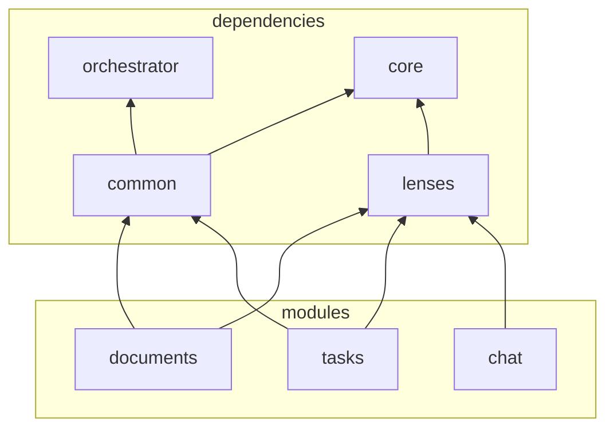
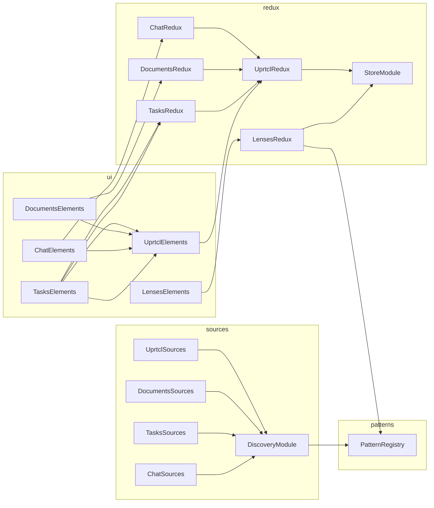

## Repositories: all begin with **@uprtcl/**

- Micro-orchestrator: UI management layer
  - StoreModule
  - ReduxModule
  - ComponentsModule
- @uprtcl/core: not UI
  - Services: multi, cached, sources, providers, connection, discovery
  - Pattern registry, default and uprtcl patterns
  - Utils
- @uprtcl/common: UI
  - MicroModules: UprtclModule, DiscoveryModule, SourcesModule
  - WebComponents: uprctl-toolbar, uprtcl-history
  - Uprtcl redux
- @uprtcl/lenses: UI lenses management
  - Lenses pattern
  - Providers
  - WebComponents: lens-renderer?
  - Lenses redux
- @uprtcl/documents: UI to deal with text-nodes
  - Redux module
  - Sources module
  - Providers
  - WebComponents: text-node?
- @uprtcl/tasks: UI to deal with tasks
  - Redux module
  - Sources module
  - Providers
  - WebComponents: kanban-board?
- @uprtcl/chat: UI to deal with chats
  - Redux module
  - Sources module
  - Providers
  - WebComponents: chats?

## Runtime instances

