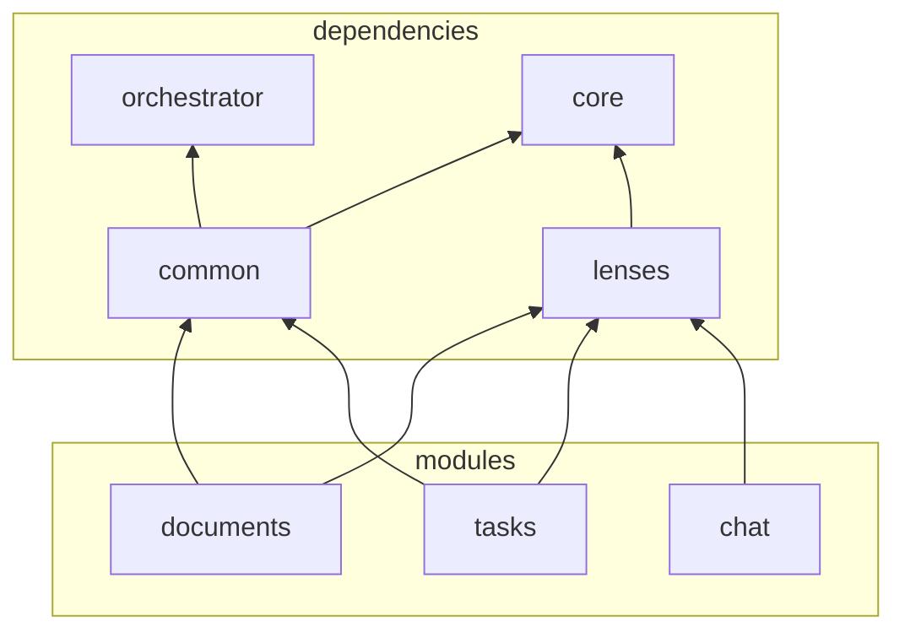
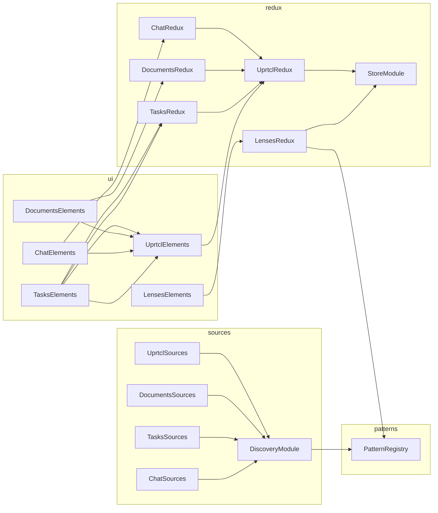

## Repositories: all begin with **@uprtcl/**

The _Prtcl JS library is a set of modules that help app developers make their apps _prtcl-compatible. 

Being _prtcl-compatible implies that some or all of the "pieces of content" of the app are handled as _prtcl contexts and:

1. Each context can evolves as a sequence of commits.
2. Each context can have more the one perspective.
3. One perspective of a context can be merged into another one.
4. Contexts can be linked with other contexts to build more complex information structures, which are by all means also contexts and, thus, can have perspectives, can be merged and can be linked too.
5. Perspectives of one context can live in diferent platforms.
6. One context (perspective) can be linked to other context (perspective) that lives in a different platforms.

## What is a context

The first step to make your app _prtcl-compatible is to define what are the "pieces of content" of which your app is made of and start thinking of them as _prtcl contexts. 

For the _prtcl, a "piece of content" can be any JSON object, and thus can have any arbitrary *internal* structure. This means that a piece of content can be, for example, a single word, a paragraph or a single image, or, it can be an entire document made of words, paragraphs and images.

The important thing to keep into account is that the *internal* elements of a context cannot be _prtcl contexts too, and, thus, cannot evolve independently with their own perspectives. Any change to an internal property represents a new version of that context and needs to be commited.

Instead, in order to have complex data structures that are contexts and are made of other (sub)contexts, these subcontexts need to be linked instead of being internal. 

Links can point to a specific perspective or commit of another context. 

- links that point to a perspective are called soft and dont require a new commit on the parent context for each commit of the child context. 
- links that point to a commit are called hard and are frozen links that will require a new commit (new link) on the parent context to be updated.

Some examples of how contexts can be used to build complex data structures are described below

- A document: TBD
- A kanban board: TBD
- A calendar: TBD

## _Prtcl stack

As an app developer, your focus is on the data. The _Prcl JS Library provides a set of modules that will handle the contexts your app uses. 

_Prtcl contexts however, are not just any piece of content. Context can have other perspectives that are not controlled by you and that are stored on places you cant control, and you may or may not want to 

##

- Micro-orchestrator: UI management layer
  - StoreModule
  - ReduxModule
  - ComponentsModule
- @uprtcl/core: not UI
  - Services: multi, cached, sources, providers, connection, discovery
  - Pattern registry, default and uprtcl patterns
  - Utils
- @uprtcl/common: UI
  - MicroModules: UprtclModule, DiscoveryModule, SourcesModule
  - WebComponents: uprctl-toolbar, uprtcl-history
  - Uprtcl redux
- @uprtcl/lenses: UI lenses management
  - Lenses pattern
  - Providers
  - WebComponents: lens-renderer?
  - Lenses redux
- @uprtcl/documents: UI to deal with text-nodes
  - Redux module
  - Sources module
  - Providers
  - WebComponents: text-node?
- @uprtcl/tasks: UI to deal with tasks
  - Redux module
  - Sources module
  - Providers
  - WebComponents: kanban-board?
- @uprtcl/chat: UI to deal with chats
  - Redux module
  - Sources module
  - Providers
  - WebComponents: chats?

## Runtime instances

